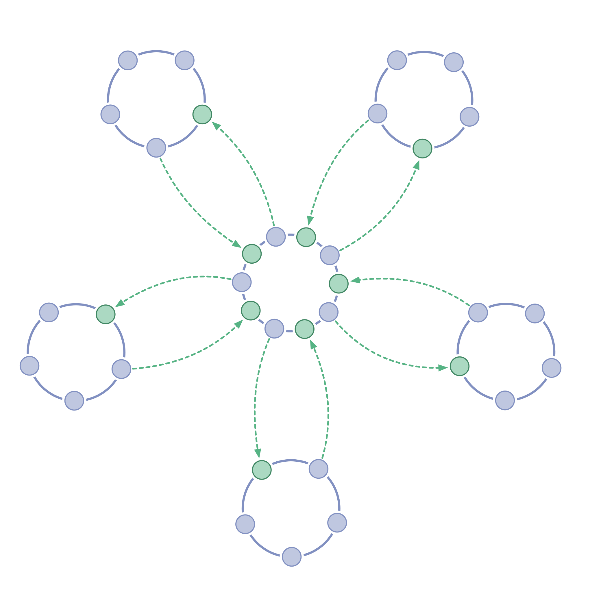

**Delegiere alle Governance-Entscheidungen an selbststeuernde Kreise, und verbinde diese Kreise jeweils nach oben und unten über den Austausch von Delegierten, um eine herkömmliche Hierarchie in eine Struktur zu überführen, die das kollektive Wissen nutzt, Gleichstellung ermöglicht und individuelles Engagement fördert.**

1. Alle Governance-Entscheidungen werden von Einzelpersonen auf Teams übertragen, indem <dfn data-info="Selbststeuerung: Eine Gruppe, sich innerhalb einer Grenzen einer Domäne selbst steuert und selbst organisiert.">selbststeuernde</dfn> <dfn data-info="Kreis: Eine teilautonomes und selbststeuerndes Team gleichgestellter Personen, die gemeinsam eine Domäne verantworten.">Kreise</dfn> auf allen Ebenen der Organisation gebildet werden.
2. Die Mitglieder eines jeden Kreises entsenden Delegierte in den nächsthöheren sowie in alle tieferen Kreise, die ihre Interessen in den <dfn data-info="Governance: Die Summer aller Aktivitäten, die dazu dienen, Ziele zu bestimmen und dann die Entscheidungen zu treffen und weiterzuentwickeln, die die Menschen dahin führen, diese Ziele zu erreichen.">Governance-</dfn>Entscheidungen dieser Kreise vertreten.

Die doppelt verbundene Hierarchie

- ermöglicht Gleichstellung bei Governance-Entscheidungen
- und ermöglicht zudem weiterhin eine Hierarchie im operativen Geschäft (sollte das dem Wertfluss dienlich sein) 

**Siehe auch:** [Kreis](Circle.html), [Doppelte Verbindung](Double-Linking.html), [Repräsentant](Representative.html)

[&#9654; Serviceorganisation](service-organization.html) [&#9664; Pfirsichorganisation](peach-organization.html) [&#9650; Organisationsstruktur](organizational-structure.html)

