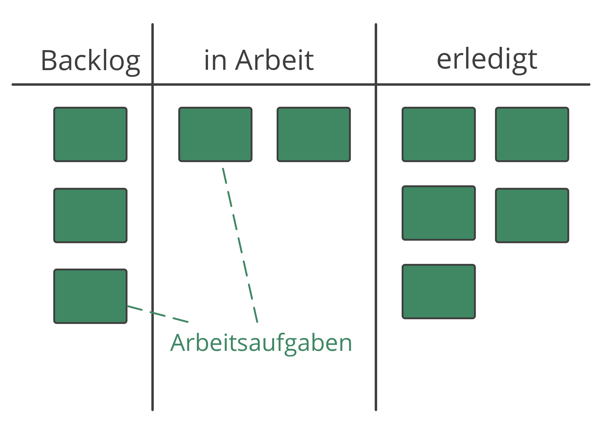

**Führe alle Arbeitsaufgaben in einem System, dass es allen Stakeholdern einfach ermöglicht, sich über den Status aller geplanten, bearbeiteten und erledigten Aufgaben zu informieren.**

- essentiell für <dfn data-info="Selbstorganisation: Alle Aktivitäten und Prozesse, durch die sich eine Gruppe mittels lokaler Interaktionen und ohne externen Einfluss organisiert. In jeder Organisation und in jedem Team koexistieren Selbstorganisation und externer Einfluss.">Selbstorganisation</dfn> und Pull-Systeme
- das System muss für alle Betroffenen zugänglich sein
- **analog**: Haftnotizen an der Wand, oder Karteikarten, Magnete und Whiteboard
- **digital**: [Trello](https://trello.com/), [Kanbanery](https://kanbanery.com/), [Leankit](https://leankit.com/), [Jira](https://www.atlassian.com/software/jira), [Google Sheets](https://www.google.com/sheets/about/), etc.

### Für jede Arbeitsaufgabe sollten folgende Dinge ersichtlich sein:

- **Art der Aufgabe** (z.B. Kundenwunsch, Projektaufgabe, Report, Nachbesserung)
- **Startdatum** (und **Fälligkeitsdatum** falls erforderlich)
- **Priorität**
- **Zustand** der Aufgabe (z.B. "unerledigt", "in Arbeit", "Review" and "erledigt")
- Hindernisse oder Blockaden
- Bearbeiter
- <dfn data-info="Vereinbarung: Eine (gemeinsam) beschlossene Richtlinie, oder ein Prozess oder Protokoll, um den Wertfluss in der Organisation zu gestalten.">Vereinbarungen</dfn> und Erwartungen zum Arbeitsablauf (z.B. Definition of Done, Policies, Qualitätsstandards)
- nutze Farben, Symbole, Highlights etc.

[&#9654; Arbeiten nach Pull-System](pull-system-for-work.html) [&#9664; Backlogs priorisieren](prioritize-backlogs.html) [&#9650; Arbeitsorganisation](organizing-work.html)

